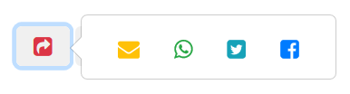
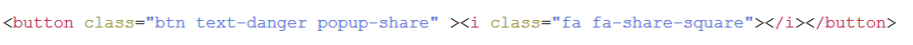

# popup-share
A small JavaScript that creates a popup share bar, for the current page, and attaches it to any tag withe the class "popup-share"

## Getting Started

popup-share requires a few libraries to work:
JQuery, bootstrap, font-awesome and popper.js

simply place the popup-share.js in your javascript folder, and set the class "popup-share" inside any clickable tag. that's it

## Installing

Needed libraries
CDNs sources:

<code>
  
 

<link rel="stylesheet" type="text/css" href="https://stackpath.bootstrapcdn.com/bootstrap/4.1.3/css/bootstrap.min.css">
<link rel="stylesheet" type="text/css" href="https://stackpath.bootstrapcdn.com/font-awesome/4.7.0/css/font-awesome.min.css">

</code>
